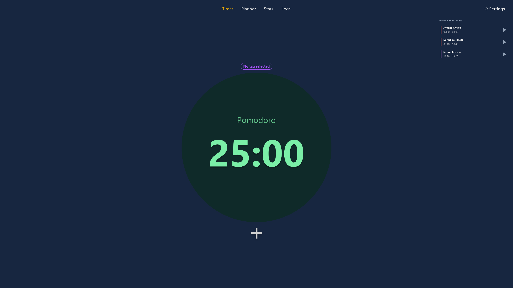
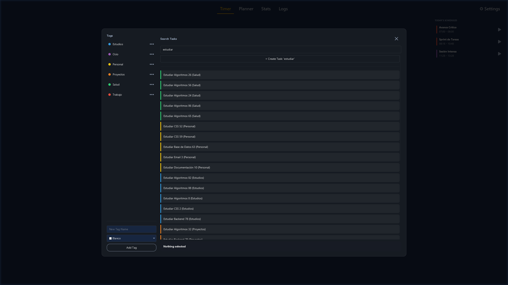
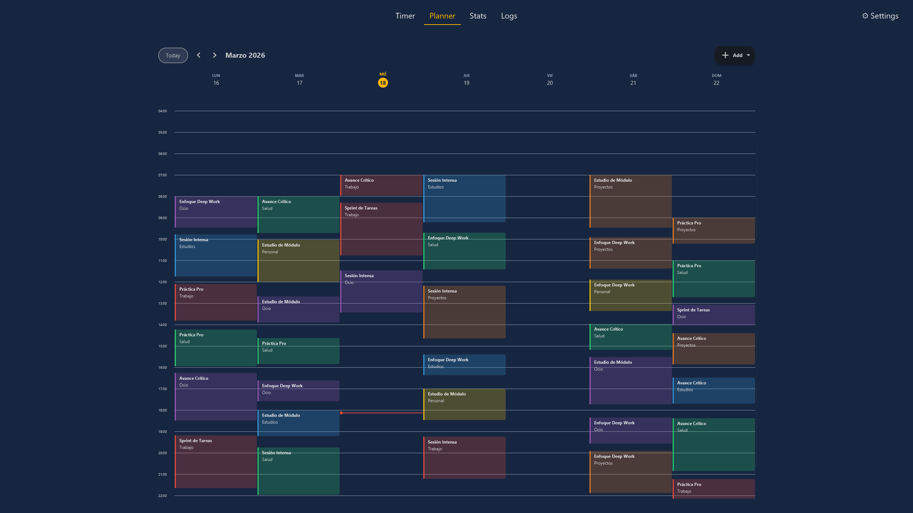
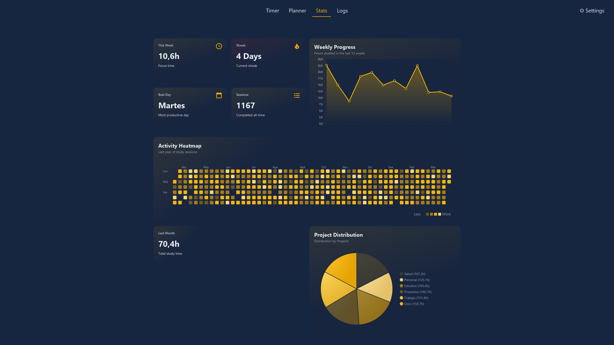
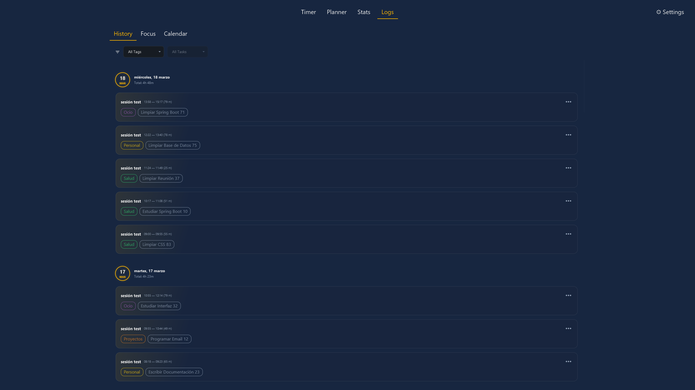
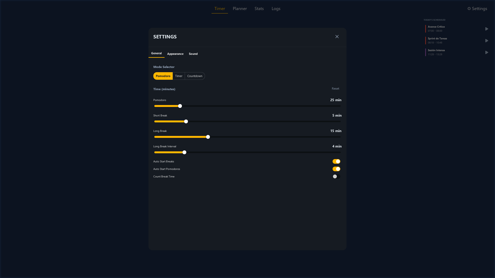

# 🎓 Study Tracker App

> **⚠️ Work in Progress:** This project is currently under active development. Some features may be incomplete or may have significant changes.
> 
A modern, minimalist application designed to manage study time. It combines techniques like **Pomodoro**, **Timer**, **Countdown** with a visual **Weekly Planner** and task tracking.
## ✨ Key Features

*   **📅 Weekly Planner:** Visual calendar with support for overlapping sessions and an intelligent sticky header for days.
*   **⏱️ Pomodoro System:** Integrated timer for focused study sessions with customizable intervals.
*   **🏷️ Tag Management:** Organize your studies by categories with dynamic colors and easy deletion.
*   **🔍 Fuzzy Search:** Quickly find tasks using a relevance-based search algorithm (FuzzyWuzzy).
*   **🌙 Modern UI:** Dark mode / Light mode design featuring smooth animations, rounded corners, and dynamic borders.
*   **📊 Data Persistence:** All your progress is stored locally using a SQLite database.
---

## 📂 Data & Configuration

The app manages its own storage environment in your user directory:

*   **Location:**
    *   **Windows:** `C:\Users\<YourUser>\.StudyTracker\`
    *   **Linux/macOS:** `/home/<YourUser>/.StudyTracker/`
*   **Key Files:**
    *   **`StudyTrackerDatabase.db`**: SQLite database containing all your tags, tasks, and scheduled sessions.
    *   **`settings.properties`**: Configuration file for your UI preferences and timer settings.
---

## 📸 Screenshots

|  |    |
|:---------------------------:|:----------------------------:|
|  |     |
|      |  |


---

## 🛠️ Installation & Setup

1. **Clone the Repository:**
   ```bash
   git clone https://github.com/frandm16/Study-Tracker.git

---

*Made by Fran Dorado*